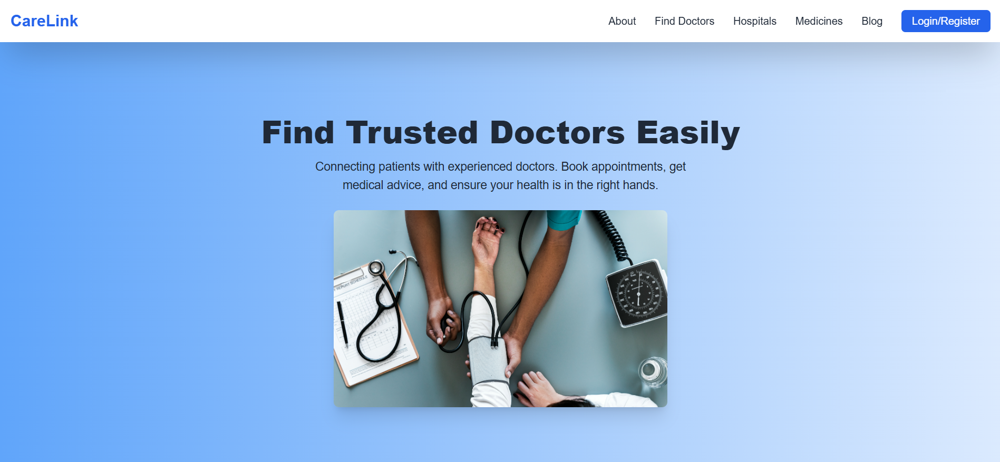
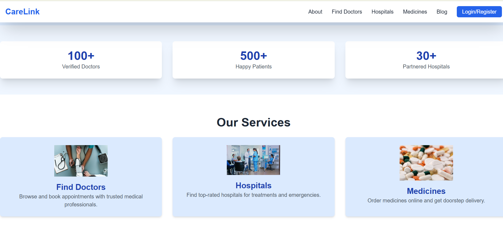
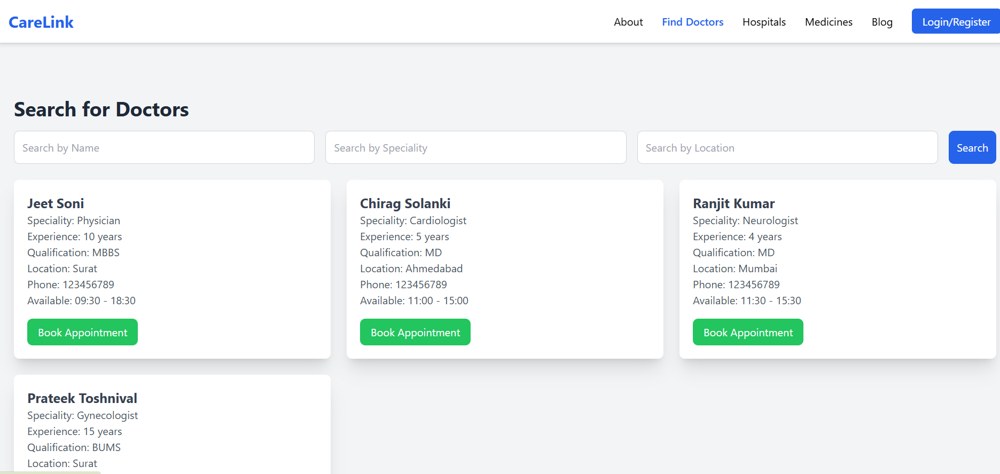
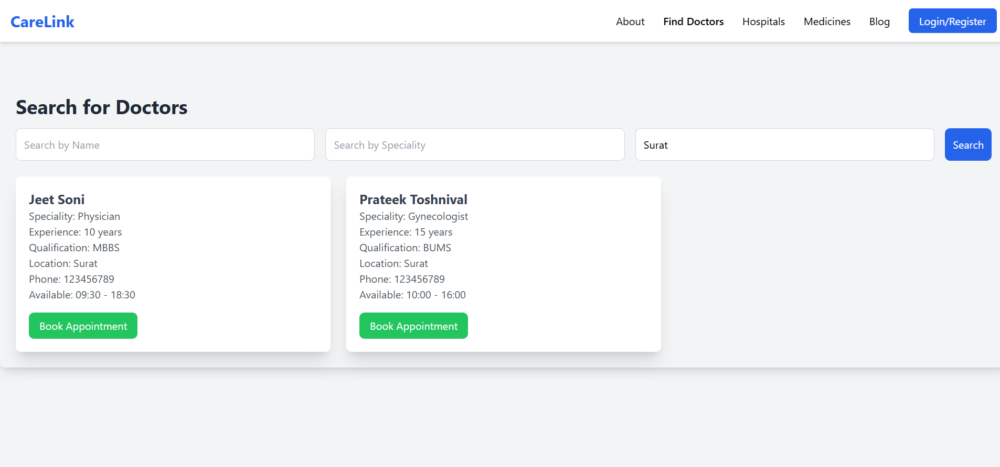
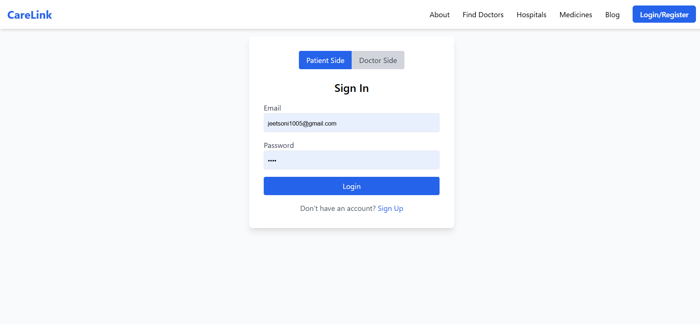
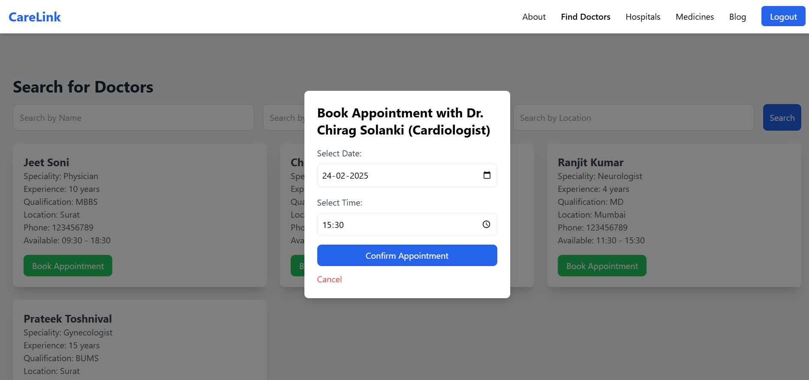
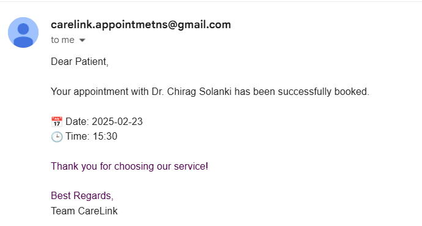

# 🏥 CareLink - Find Your Doctor Easily  

CareLink is a healthcare platform that connects patients with trusted doctors. It allows users to search for doctors, book appointments, explore hospitals, medicines, and read medical blogs.  

---

## 🚀 Features  

### 🔑 User Authentication  
- **Login/Register** – Users must sign up and log in to access the booking features.  
- **Secure Access** – Only registered users can book appointments.  

### 🏥 Doctor Functionality  
- **Doctor Registration** – Doctors can register with their details, including:  
  - Specialization  
  - Qualification  
  - Availability  
- **Doctor Search** – Users can search doctors by:  
  - Name  
  - Specialization  
  - Location  

### 📅 Appointment Booking  
- **Registered Users Only** – Patients can book appointments only if they are logged in.  
- **Confirmation Email** – Uses **Nodemailer** to send an email confirmation when an appointment is booked.  

### 🏛️ Additional Features (Under Construction)
- **Find Hospitals** – Users can explore nearby hospitals.  
- **Medicine Information** – Get details about medicines and their usage.  
- **Healthcare Blog** – Read medical articles and health tips.  

---

## 🛠️ Tech Stack  
- **Frontend**: HTML, CSS (TailwindCSS), JavaScript (EJS for templating)  
- **Backend**: Node.js, Express.js  
- **Database**: MongoDB  
- **Email Service**: Nodemailer (for appointment confirmation emails)  

---

## 🎯 How to Run Locally  

### 1️⃣ Clone the Repository  
```bash
git clone https://github.com/your-username/CareLink.git
cd CareLink
```  

### 2️⃣ Install Dependencies  
```bash
npm install
```  

### 3️⃣ Setup Environment Variables  
Create a `.env` file in the root folder and add:  
```
MONGO_URI=your_mongodb_connection_string
SESSION_SECRET=your_secret_key
EMAIL=your_email@example.com
PASSWORD=your_email_password
```

### 4️⃣ Start the Server  
```bash
npm start
```  
The app will run on `http://localhost:3000`.  

---

## 🔒 Environment Variables  
Ensure you configure these environment variables correctly:  
| Variable | Description |  
|----------|-------------|  
| `MONGO_URI` | MongoDB connection string |  
| `SESSION_SECRET` | Secret key for session management |  
| `EMAIL` | Email address used to send appointment confirmations |  
| `PASSWORD` | Password or app-specific password for the email account |  

---

## 🎨 UI Preview  

  
  
 
  
  
  


---

## 📜 License  
This project is open-source. Feel free to use and modify it.  

---

## 📧 Contact  
For any queries, reach out at `jeetsoni1005@gmail.com`.  

---

🚀 **CareLink – Simplifying Healthcare Appointments!** 🏥💙  
```
